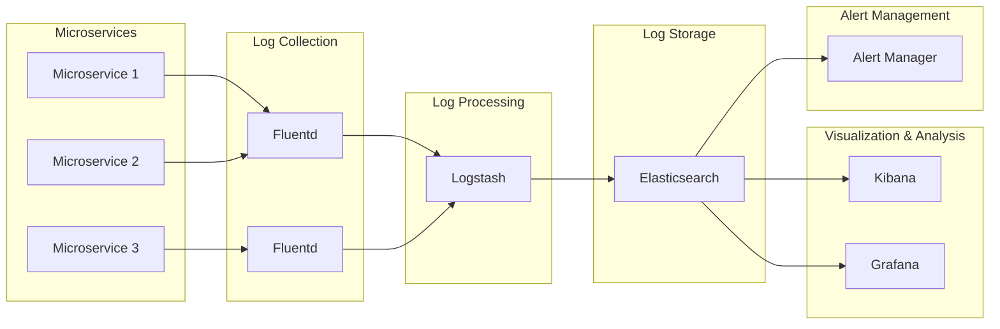

```mermaid
flowchart LR
    subgraph Apps[Microservices]
        MS1[Microservice 1]
        MS2[Microservice 2]
        MS3[Microservice 3]
    end
    
    subgraph Collectors[Log Collection]
        F1[Fluentd]
        F2[Fluentd]
    end
    
    subgraph Processing[Log Processing]
        LS[Logstash]
    end
    
    subgraph Storage[Log Storage]
        ES[Elasticsearch]
    end
    
    subgraph Visualization[Visualization & Analysis]
        K[Kibana]
        G[Grafana]
    end

    MS1 --> F1
    MS2 --> F1
    MS3 --> F2
    F1 --> LS
    F2 --> LS
    LS --> ES
    ES --> K
    ES --> G

    subgraph Alerting[Alert Management]
        AM[Alert Manager]
    end
    
    ES --> AM
```