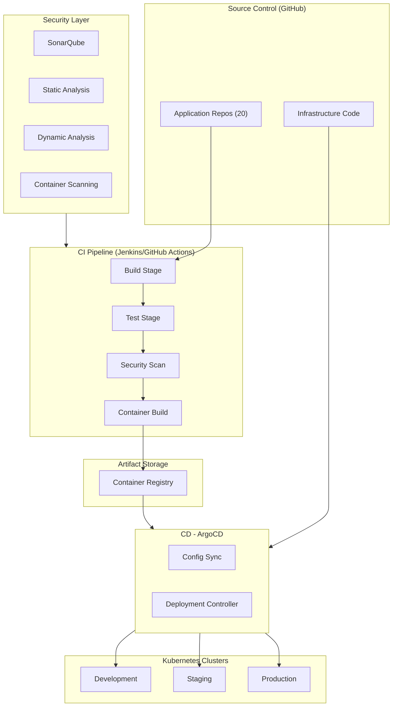

```mermaid
flowchart TB
    subgraph SCM["Source Control (GitHub)"]
        App["Application Repos (20)"]
        IaC["Infrastructure Code"]
        direction TB
    end
    
    subgraph Security["Security Layer"]
        SCA["SonarQube"]
        SAST["Static Analysis"]
        DAST["Dynamic Analysis"]
        ImgScan["Container Scanning"]
    end
    
    subgraph CI["CI Pipeline (Jenkins/GitHub Actions)"]
        Build["Build Stage"]
        Test["Test Stage"]
        Scan["Security Scan"]
        Package["Container Build"]
    end
    
    subgraph Registry["Artifact Storage"]
        Docker["Container Registry"]
    end
    
    subgraph CD["CD - ArgoCD"]
        Config["Config Sync"]
        Deploy["Deployment Controller"]
    end
    
    subgraph K8s["Kubernetes Clusters"]
        Dev["Development"]
        Stage["Staging"]
        Prod["Production"]
    end

    App --> Build
    Build --> Test
    Test --> Scan
    Scan --> Package
    Package --> Docker
    
    Security --> CI
    
    Docker --> CD
    IaC --> CD
    
    CD --> Dev
    CD --> Stage
    CD --> Prod
```